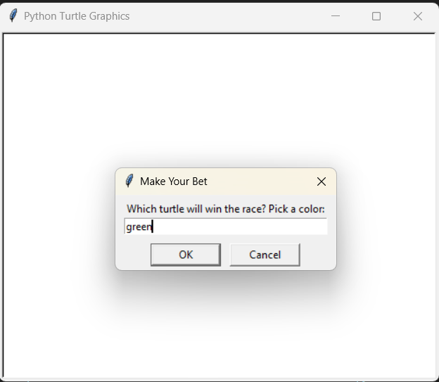
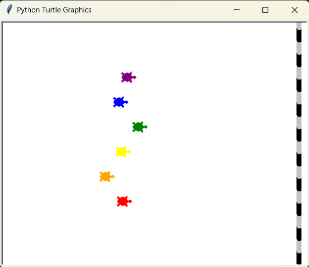
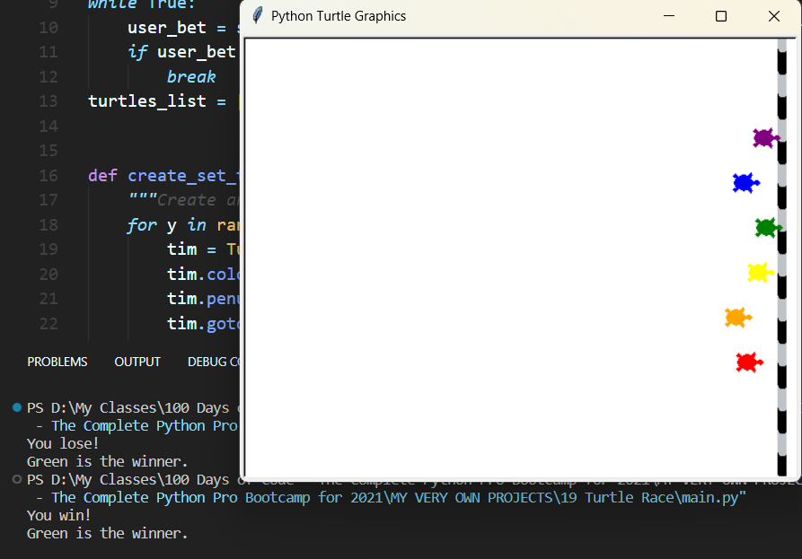

# Turtle Race

## Introduction
"Turtle Race" is a Python-based simulation game that allows players to bet on the outcome of a race between colored turtles. The game utilizes Python's Turtle graphics library to visually represent the race and provides an interactive betting prompt for the user.

## Features
- **Colorful Turtles**: Six turtles, each with a unique color, race towards the finish line.
- **User Betting**: Before the race begins, the user is prompted to bet on which turtle they believe will win.
- **Randomized Movement**: Each turtle's movement is randomized to simulate a race.
- **Finish Line**: A finish line is drawn on the screen to mark the end of the race.
- **Race Outcome**: The game announces the winner of the race and whether the user's bet was successful.

## Requirements
- Python 3.x
- Turtle Graphics Library

## Installation
No additional installation is required apart from Python and its built-in Turtle library.

## How to Play
1. **Start the Game**: Run the script in Python to begin.
2. **Make Your Bet**: A pop-up window will prompt you to enter the color of the turtle you want to bet on.
3. **Watch the Race**: Once the bet is placed, the race starts, and the turtles begin moving towards the finish line.
4. **Race Results**: After a turtle crosses the finish line, the game announces the winning turtle and whether the player won or lost the bet.

## Screenshots

## Contributing
Feel free to fork the project and contribute by adding new features, such as different race lengths, betting systems, or additional graphical enhancements. Please ensure your pull requests are well-documented.
