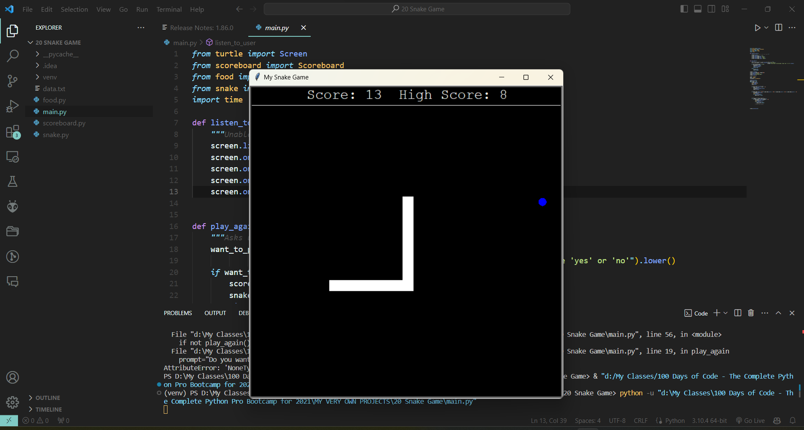
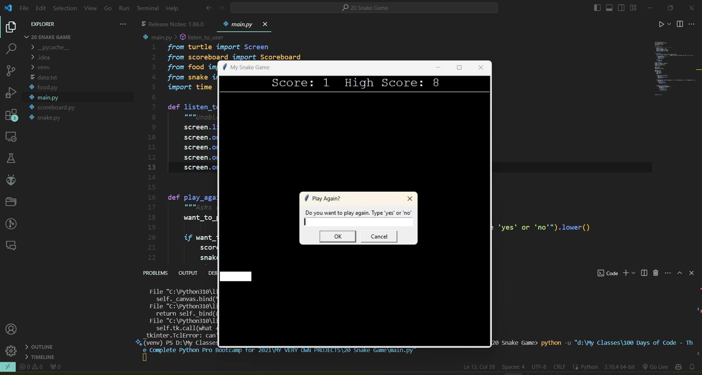

# Snake Game

Welcome to the Snake Game! A classic arcade game reimagined in Python. Control the snake and eat the food to grow. Try to achieve the highest score possible without running into the walls or biting your own tail.

## Table of Contents

- [Installation](#installation)
- [Usage](#usage)
- [Features](#features)
- [Screenshots](#screenshots)
- [Contributing](#contributing)
- [License](#license)

## Installation

To play the Snake Game, you need to have Python installed on your computer. This game was built using Python 3.8 or above.

1. Clone the repository or download the source code:
   ```sh
   git clone https://your-repository-link-here.git
   ```
2. Navigate to the game directory:
   ```sh
   cd Snake-Game
   ```
3. Run the game:
   ```sh
   python main.py
   ```

## Usage

After launching the game, use the arrow keys to control the direction of the snake:

- `Up` arrow key to move up
- `Down` arrow key to move down
- `Left` arrow key to move left
- `Right` arrow key to move right

Eat the blue food that appears on the screen to grow your snake and earn points.

## Features

- Smooth snake movement and collision detection
- Score tracking with high score saving
- End game detection with a prompt to play again
- Simple and intuitive user interface

## Screenshots

Here are some glimpses of the Snake Game in action:

  
*Initial game screen with snake and food*

  
*Game over screen with score display and play again prompt*

Replace `path-to-your-screenshot-file` with the actual path to your screenshot files. If your README is hosted on a platform like GitHub, you can upload the images to your repository and link them directly.

## Contributing

If you'd like to contribute to the Snake Game, please fork the repository and create a pull request with your changes.

1. Fork the Project
2. Create your Feature Branch (`git checkout -b feature/AmazingFeature`)
3. Commit your Changes (`git commit -m 'Add some AmazingFeature'`)
4. Push to the Branch (`git push origin feature/AmazingFeature`)
5. Open a Pull Request

## License

Distributed under the MIT License. See `LICENSE` for more information.

---

This `README` provides a clear and concise description of your project and how to run it. It also includes placeholders for screenshots, which are crucial for visualizing the game. Remember to replace placeholder text with actual paths or URLs to the screenshots before finalizing the README.
