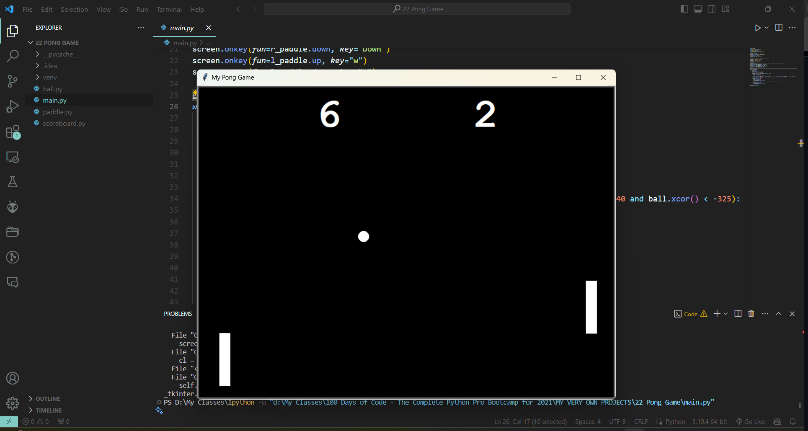

# Pong Game

## Introduction
"Pong Game" is a classic arcade tennis sports game featuring simple two-dimensional graphics. This Python implementation of the game allows two players to control paddles on the screen to hit the ball back and forth. The goal is to score points by getting the ball past the opponent's paddle.

## Features
- **Two-Player Gameplay**: Control paddles using keyboard inputs for an engaging two-player experience.
- **Real-Time Ball Movement**: The ball moves across the screen in real-time, bouncing off walls and paddles.
- **Score Tracking**: The game keeps track of each player's score with an on-screen scoreboard.
- **Collision Detection**: The game detects collisions with paddles and walls, altering the ball's trajectory.
- **Speed Increase**: The ball's speed increases slightly with each paddle hit, increasing the challenge over time.

## Requirements
- Python 3.x
- Turtle Graphics Library

## Installation
No additional installation is required apart from Python and its built-in Turtle library.

## How to Play
1. **Start the Game**: Run `main.py` to launch the game.
2. **Control the Paddles**: Player 1 uses the 'W' and 'S' keys to move the left paddle up and down, while Player 2 uses the 'Up' and 'Down' arrow keys for the right paddle.
3. **Begin the Match**: The ball will start moving automatically. Each player tries to return the ball back to the opponent.
4. **Keep Score**: The game tracks points and updates the scoreboard when a player fails to return the ball.
5. **End Game**: The game continues indefinitely. Players can close the window to end the game.

## Screenshot

## File Structure
- `ball.py`: Defines the `Ball` class, handling the ball's movement and interactions.
- `paddle.py`: Defines the `Paddle` class, creating paddle objects that players control.
- `scoreboard.py`: Defines the `Scoreboard` class, which updates and displays the score.
- `main.py`: The main script where the game loop runs and user interactions are handled.

## Contributing
Contributions to improve the game are welcome. Ideas include adding a winning condition, creating a single-player mode against a computer opponent, or introducing additional game mechanics. Please ensure your code is well-documented and tested.

This project is freely available for all to use and is distributed under the [MIT License](https://choosealicense.com/licenses/mit/).

---

This README provides all the necessary information for understanding, installing, and playing the "Pong Game". Note that the path to the screenshot in the README will need to be updated to the actual file path where the image is stored.
