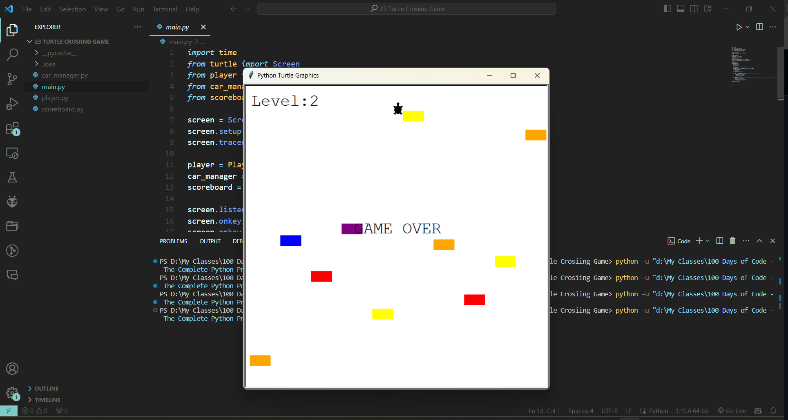

# Turtle Crossing Game

## Introduction
"Turtle Crossing Game" is an interactive Python game where the player controls a turtle that must cross a busy road full of moving cars. The objective is to navigate the turtle safely across the road and reach the other side without getting hit by cars. As the player progresses through the levels, the game increases in difficulty by speeding up the cars.

## Features
- **Player Movement**: Use the keyboard to move the turtle up or down.
- **Dynamic Car Generation**: Cars are randomly generated and move across the screen.
- **Level Progression**: Each successful crossing increases the level and the speed of cars.
- **Collision Detection**: The game detects collisions between the turtle and cars.
- **Scoreboard**: Displays the current level at the top of the screen.
- **Game Over Sequence**: Indicates the game is over by displaying "GAME OVER" on the screen.

## Requirements
- Python 3.x
- Turtle Graphics Library

## Installation
No additional installation is required apart from Python and its built-in Turtle library.

## How to Play
1. **Start the Game**: Run `main.py` to launch the game.
2. **Control the Turtle**: Use the 'Up' arrow key to move the turtle forward and the 'Down' arrow key to move it backward.
3. **Avoid Cars**: Navigate across the road and avoid oncoming cars.
4. **Reach the Finish Line**: Successfully cross the road to progress to the next level.
5. **End Game**: The game ends when the turtle is hit by a car or when the player closes the window.

## Screenshot

## File Structure
- `car_manager.py`: Contains the `CarManager` class that manages the creation and movement of cars.
- `player.py`: Defines the `Player` class for the turtle that the user controls.
- `scoreboard.py`: Defines the `Scoreboard` class for displaying the level and game over message.
- `main.py`: The main script where the game loop and key bindings are established.

## Contributing
Feel free to contribute to the project by adding new features like different obstacles, improved graphics, sound effects, or additional levels. Please ensure your contributions are well-documented and include appropriate testing.
