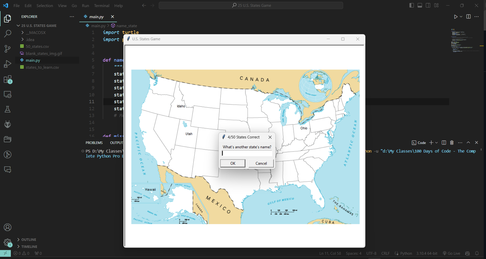

# U.S. States Game

## Introduction
The "U.S. States Game" is an educational Python game designed to help players learn the names and geographical locations of the 50 states in the United States. Using the Turtle graphics library, the game displays a blank map of the U.S., and players are prompted to enter the names of states one by one. Each correctly guessed state is then labeled on the map. If the player wishes to end the game early, they can type 'Exit' to create a CSV file of the states they still need to learn.

## Features
- **Educational Gameplay**: Encourages learning U.S. states' names and locations.
- **Interactive Prompt**: Players type in the name of states they recall.
- **State Validation**: Checks whether the entered name is indeed a U.S. state.
- **State Positioning**: Places the correct state name on the map based on coordinates.
- **Learn from Misses**: Generates a CSV file with the states the player did not guess.

## Requirements
- Python 3.x
- Turtle Graphics Library
- Pandas Library

## Installation
1. Ensure Python 3.x is installed on your system.
2. Install Pandas if not already available using `pip install pandas`.

## How to Play
1. **Start the Game**: Run `main.py` to begin the game.
2. **Guess States**: Enter the names of states into the prompt as they come to mind.
3. **Type 'Exit'**: If you wish to stop, type 'Exit' to generate a CSV file with the states you need to learn.
4. **View Progress**: The game shows how many states have been correctly identified.
5. **End Game**: The game ends when all 50 states are correctly guessed or when the player decides to stop.

## Screenshot

## File Structure
- `main.py`: The main script for running the game.
- `50_states.csv`: The dataset containing the names and coordinates for placing the state names on the screen.
- `states_to_learn.csv`: Generated by the game to list states the player needs to learn, if they exit early.

## Contributing
If you'd like to contribute to improving the game, perhaps by adding more educational content or enhancing the game's user interface, your input is welcome. Please ensure your contributions are well-documented and tested.
