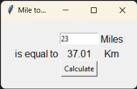

# Miles to Km Converter

## Introduction
The "Miles to Km Converter" is a simple and user-friendly desktop application built with Python's Tkinter library. It allows users to convert distances in miles to kilometers. The application features a clean and intuitive graphical user interface where users can input values in miles and get the equivalent distance in kilometers.

## Features
- **Simple Interface**: A minimalistic design that is straightforward to use.
- **Immediate Conversion**: Users can convert miles to kilometers with a single click.
- **Accurate Calculation**: The conversion uses the standard conversion factor ensuring accurate results.
- **Responsive Layout**: The application window adjusts neatly to different screen sizes and resolutions.

## Requirements
- Python 3.x
- Tkinter Library (usually included with Python)

## Installation
1. Ensure Python 3.x is installed on your system.
2. There is no need for additional installations since Tkinter comes bundled with Python.

## How to Use
1. **Open the Application**: Run `main.py` to open the converter window.
2. **Enter Miles**: Type the distance in miles into the input field.
3. **Convert**: Click the "Calculate" button to convert the entered distance to kilometers.
4. **View Results**: The converted distance in kilometers is displayed immediately on the interface.

## Screenshot

## File Structure
- `main.py`: Contains the main application code, including the Tkinter window, layout, and conversion logic.

## Contributing
Contributions to improve the converter are welcome. Possible improvements include adding a clear button, implementing unit selection, or enhancing the visual design. Please provide clear documentation for your changes and adhere to the existing coding style.

