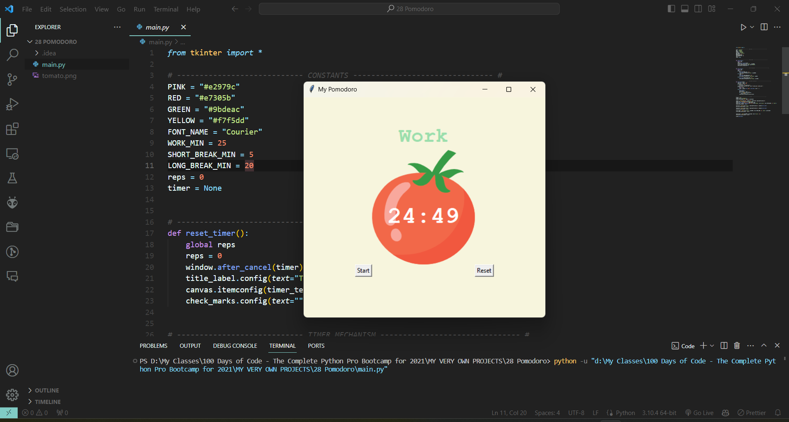

# Pomodoro

## Introduction
The "Pomodoro" app is a time management application based on the Pomodoro Technique. This technique uses a timer to break work into intervals, traditionally 25 minutes in length, separated by short breaks. The app is created with Python's Tkinter library and provides a simple, easy-to-use graphical user interface to help users focus on tasks.

## Features
- **Custom Work/Break Times**: Set the work session duration and short/long break durations.
- **Automatic Timer**: The app counts down from the specified time and automatically starts a break or work session when the previous one ends.
- **Reset Functionality**: Allows users to reset the timer at any point.
- **Progress Tracking**: Displays check marks to indicate the number of work sessions completed.
- **Soothing UI**: The interface includes a calming tomato image and color scheme to minimize distractions.

## Requirements
- Python 3.x
- Tkinter Library (usually included with Python)

## Installation
1. Ensure Python 3.x is installed on your system.
2. There is no need for additional installations since Tkinter comes bundled with Python.

## How to Use
1. **Launch the App**: Run `main.py` to start the Pomodoro app.
2. **Start the Timer**: Click the "Start" button to begin the work timer.
3. **Work Session**: Focus on your task until the timer ends.
4. **Take a Break**: Once the timer ends, take a short or long break as indicated.
5. **Reset if Needed**: Use the "Reset" button to stop the current timer and reset the session count.
6. **Track Progress**: The check marks at the bottom indicate the number of work sessions completed.

## Screenshot

## File Structure
- `main.py`: Contains the main application code, including UI setup and timer functionality.
- `tomato.png`: An image file used as a background for the timer.

## Contributing
If you have suggestions for new features, such as sound notifications, detailed statistics, or customization options, your contributions are welcome. Please ensure your code is well-documented and adheres to the project's coding standards.

