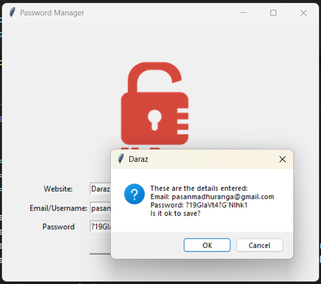
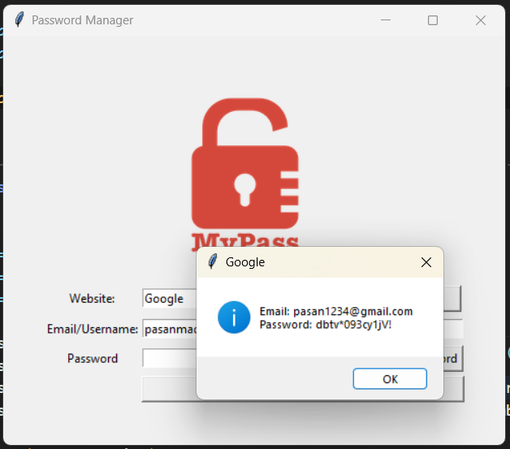

# Password Manager

## Introduction
Password Manager is a secure and user-friendly application built with Python's Tkinter library. It helps users store and manage their passwords effectively. The application allows for generating strong, random passwords and saving them alongside corresponding website and email information. It includes a search functionality to quickly retrieve stored passwords.

## Features
- **Password Generation**: Securely generate random and robust passwords.
- **Data Storage**: Save website, email, and password information locally in a JSON file.
- **Search Functionality**: Easily retrieve password details for specific websites.
- **User Notifications**: Display alerts and confirmations through popup messages.
- **Clipboard Copy**: Automatically copy generated passwords to the clipboard for easy use.
- **Data Validation**: Ensure all fields are filled before saving to prevent incomplete entries.

## Requirements
- Python 3.x
- Tkinter Library (included with Python)
- Pyperclip Library for clipboard operations

## Installation
1. Ensure Python 3.x is installed on your system.
2. Install Pyperclip if not already available using `pip install pyperclip`.

## Usage
1. **Launch the Application**: Run `main.py` to open the Password Manager.
2. **Generate a Password**: Click "Generate Password" to create a new password, which will be copied to the clipboard.
3. **Save Password Details**: Fill in the website and email information and click "Add" to save the details.
4. **Search for Password**: Use the "Search" button to find passwords for existing entries.
5. **Data Persistence**: All data is saved in `data.json` and persists between sessions.

## Screenshots

## File Structure
- `main.py`: The main script containing the application logic and user interface.
- `data.json`: A JSON file that stores the saved password information.
- `logo.png`: The logo image displayed in the application window.

## Contributing
Contributions to add new features, such as encryption for stored passwords, cloud sync, or UI improvements, are welcome. Please document your code changes well and ensure compatibility with the existing application structure.
