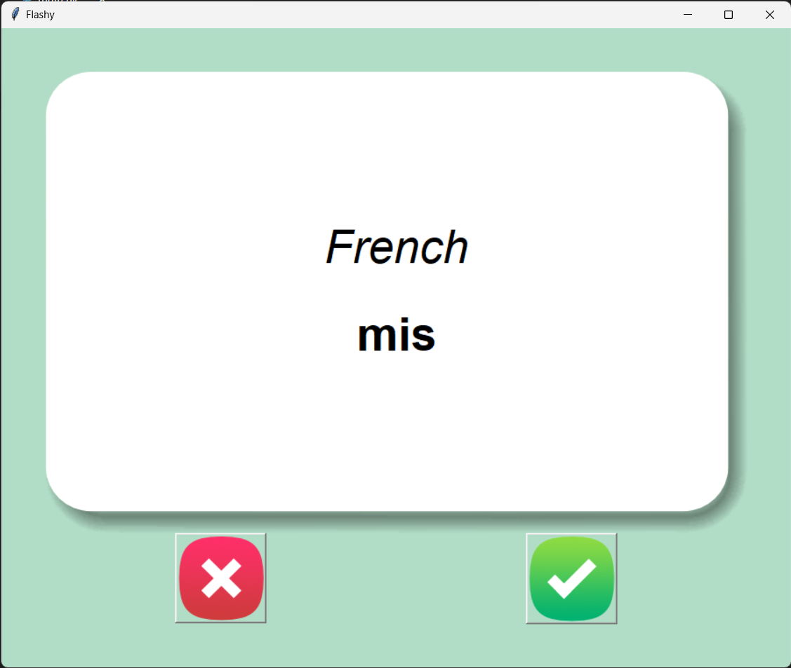
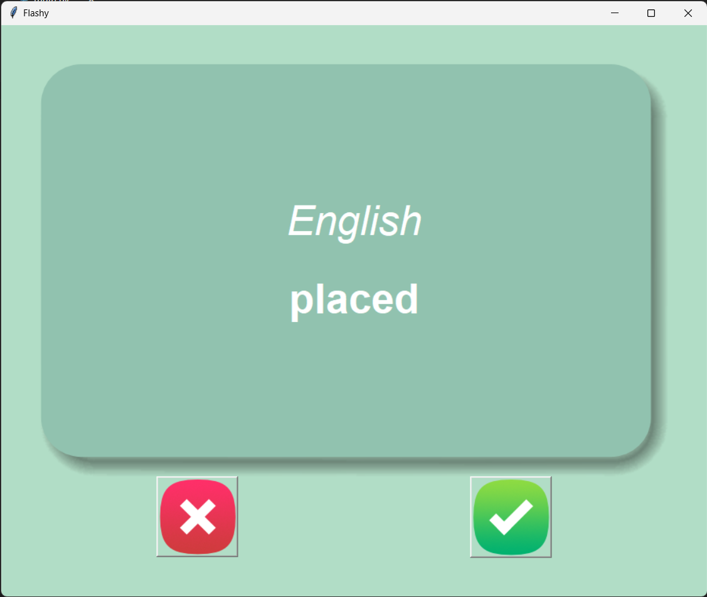

# Flash Card Project

## Introduction
The Flash Card Project is a language learning tool designed to assist with vocabulary memorization. Utilizing a simple and interactive flashcard system, users can practice and reinforce their language skills, starting with French-English word pairs.

## Features
- **Interactive Flashcards**: Click through flashcards showing French words and their English translations.
- **Timed Flip**: Cards automatically flip after 3 seconds to reveal the English translation.
- **Progress Tracking**: Keep track of words you've learned and focus on those you haven't mastered yet.
- **Responsive UI**: Intuitive and simple user interface for distraction-free learning.
- **Persistent Storage**: Your progress is saved, so you can pick up right where you left off.

## Requirements
- Python 3.x
- Tkinter Library (included with Python)
- Pandas Library for data manipulation

## Installation
1. Ensure Python 3.x is installed on your system.
2. Install Pandas if not already available using `pip install pandas`.

## Usage
1. **Start the Application**: Run the `main.py` script to launch the flashcard application.
2. **Learning Words**: The app displays a French word which flips to its English translation after 3 seconds.
3. **Known Words**: Click on the checkmark if you know the word, and it will be removed from your learning list.
4. **Unknown Words**: Click on the cross if you need more practice with the word, and it will remain in the rotation.
5. **Data Storage**: The list of words to learn is stored in `data/words_to_learn.csv`, automatically excluding known words.

## Screenshots

## File Structure
- `main.py`: The main application script with logic for the flashcard functionality.
- `french_words.csv`: Initial list of French words and their English translations.
- `words_to_learn.csv`: A custom list that evolves based on the user's learning.
- `images/`: Directory containing images used for the flashcard interface.

## Contributing
Contributions are welcome, especially in adding new languages, improving the UI, and extending the features to support a more interactive learning experience. If you're interested in contributing, please fork the repository and submit a pull request with your proposed changes.
