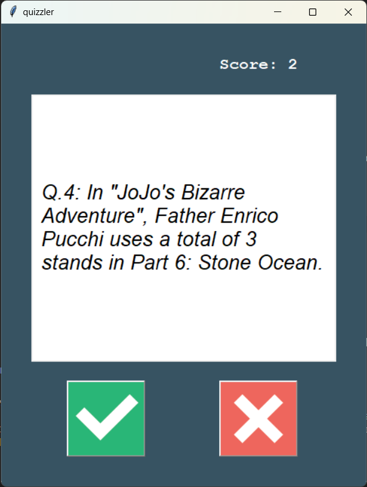

# Quizzler App

## Description
The Quizzler App is a trivia quiz game built using Python that fetches questions from an online API. It presents the user with a series of true or false questions and keeps track of their score. The app utilizes the `requests` module to communicate with the Open Trivia Database API to dynamically generate questions for each game session.

## Features
- Fetches trivia questions of boolean type from the Open Trivia Database.
- Presents a simple graphical user interface (GUI) using Tkinter for interaction.
- Tracks the user's score and updates it with each correct answer.
- Displays a green background for correct answers and red for incorrect ones.
- Shows a final score when the user completes the quiz.

## How to Use
1. Clone the repository to your local machine.
2. Ensure you have Python installed along with the Tkinter and requests modules.
3. Run `main.py` to start a quiz game.
4. Click the true or false buttons to answer each question.
5. Your score will be updated as you go, with visual feedback provided for each answer.
6. At the end of the quiz, your final score will be displayed.

## Screenshots

## Contributing
Contributions are welcome, particularly in the following areas:
- Expanding the variety of questions by integrating different APIs or adding more categories.
- Enhancing the user interface for a more engaging user experience.
- Adding new features, such as different difficulty levels or timed questions.

Please ensure your pull requests adhere to the following guidelines:
- Describe the changes clearly in the pull request description.
- Maintain the coding style and conventions used throughout the project.
- Test your changes thoroughly to ensure they work as expected.

Thank you for helping improve the Quizzler App!
