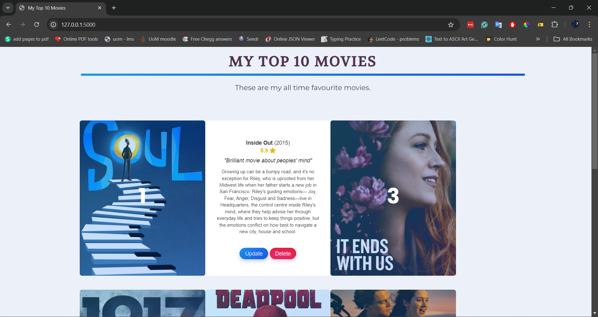

# My Best Movies Site



## Overview

**My Best Movies Site** is a dynamic web application built using Flask, SQLAlchemy, and Bootstrap. The project allows users to create, view, and manage a personalized list of their favourite movies. Users can add movies to the list, edit ratings and reviews, and delete movies from their collection. The movie data is fetched from The Movie Database (TMDb) API, ensuring accurate and up-to-date information about each movie.

## Features

- **Add Movies**: Users can search for movies using the TMDb API and add them to their list.
- **Edit Ratings and Reviews**: Users can update their ratings and reviews for each movie.
- **Delete Movies**: Users can remove movies from their list.
- **Dynamic Ranking**: Movies are dynamically ranked based on user ratings.
- **Responsive Design**: The application is fully responsive, utilizing Bootstrap for a clean and adaptable layout.

## Technology Stack

- **Flask**: A lightweight WSGI web application framework in Python.
- **Flask-Bootstrap**: Integration of Bootstrap 4 for responsive design and styling.
- **Flask-WTF**: Simplifies form creation and validation in Flask.
- **SQLAlchemy**: SQL toolkit and Object-Relational Mapping (ORM) library for managing the SQLite database.
- **TMDb API**: Provides access to a vast collection of movie data, enabling accurate movie search and retrieval.

## Installation

### Prerequisites

- **Python 3.x**: Ensure you have Python 3 installed on your system. You can download it from [python.org](https://www.python.org/downloads/).
- **Flask**: Flask should be installed in your environment.

### Installing Dependencies

You can install the required dependencies using `pip`. Navigate to the project directory and run:

```bash
pip install -r requirements.txt
```

If the `requirements.txt` file is not available, you can manually install the necessary packages:

```bash
pip install flask flask_bootstrap flask_sqlalchemy flask_wtf requests
```

### Setting Up the TMDb API

1. Obtain an API key from [The Movie Database (TMDb)](https://www.themoviedb.org/documentation/api).
2. Replace the placeholder `API_KEY` in the `main.py` file with your actual TMDb API key.

### Setting Up the Database

The project uses SQLite as the database backend. The database is automatically created and managed by SQLAlchemy. To initialize the database, simply run the application for the first time:

```bash
python main.py
```

### Running the Application

To start the Flask development server, execute:

```bash
python main.py
```

Then, open your web browser and navigate to `http://127.0.0.1:5000/` to view the application.

## Usage

1. **Home Page**: View a list of your top movies, ranked by rating.
2. **Add a Movie**: Use the "Add Movie" button to search for and add a new movie to your list.
3. **Edit a Movie**: Click on a movie in the list to update its rating and review.
4. **Delete a Movie**: Remove a movie from your list by clicking the "Delete" button.

## Project Structure

- **`main.py`**: The main application file containing all the routes, logic, and database interactions.
- **`templates/`**: Contains the HTML templates used for rendering the pages (home, add, edit, select).
  - **`index.html`**: The home page template that lists all movies.
  - **`add.html`**: The template for adding a new movie.
  - **`edit.html`**: The template for editing the rating and review of a movie.
  - **`select.html`**: The template for selecting a movie from search results.
- **`static/`**: Contains static files like CSS and JavaScript.
- **`greatest-movies.db`**: The SQLite database file that stores all movie information.

## Troubleshooting

- **Invalid API Key**: Ensure that you have replaced the placeholder API key with a valid TMDb API key.
- **Database Issues**: If the database does not update or initialize correctly, try deleting the `greatest-movies.db` file and rerunning the application to recreate it.
