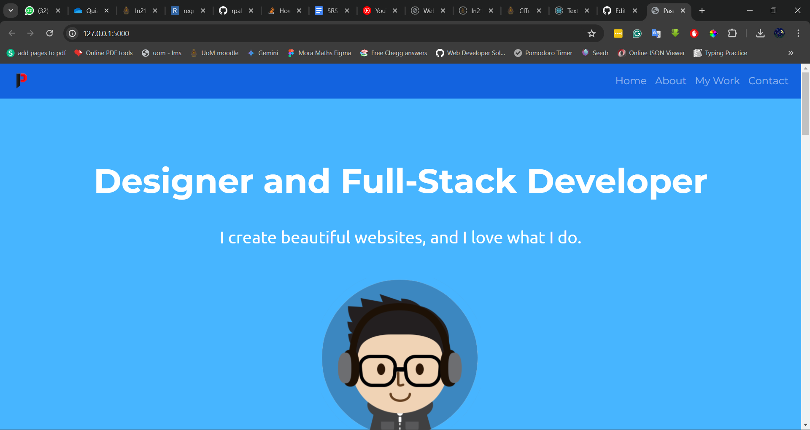

# Portfolio Website

The "Portfolio Website" is a personal web page designed to showcase my work and skills of mine. It is created using HTML, CSS, and the Flask web framework, featuring Bootstrap for styling.

## Features

- Responsive design with Bootstrap integration.
- Includes sections like Home, About, My Work, and Contact.
- Carousel for testimonials.
- Navigation bar for easy browsing through different sections.

## Requirements

- Flask
- Flask-Bootstrap
- Python

## Installation

1. Ensure you have Python installed on your system.
2. Install Flask and Flask-Bootstrap using pip:

```sh
pip install Flask Flask-Bootstrap
```

## Usage

1. Run the Flask application by executing the `main.py` script:

```sh
python main.py
```

2. Visit `http://127.0.0.1:5000/` in your web browser to view the website.

## Project Structure

- `main.py`: The Flask server script.
- `index.html`: The main HTML file for the homepage.
- `header.html`: The header component of the website.
- `footer.html`: The footer component of the website.
- `static/`: Directory containing static files such as CSS, images, and JavaScript.
- `templates/`: Directory containing HTML templates.

## Screenshots


## Customization

To customize the website, you can edit the HTML templates and static files. Add your personal information, work samples, and contact details in the respective sections.

## Contributing

To contribute to this project:

1. Fork the repository.
2. Create a new branch for your feature.
3. Commit your changes.
4. Push to the branch.
5. Submit a pull request.

## Acknowledgments

- Bootstrap for the responsive design components.
- Font Awesome for the icons used across the website.
- Google Fonts for the typography.
