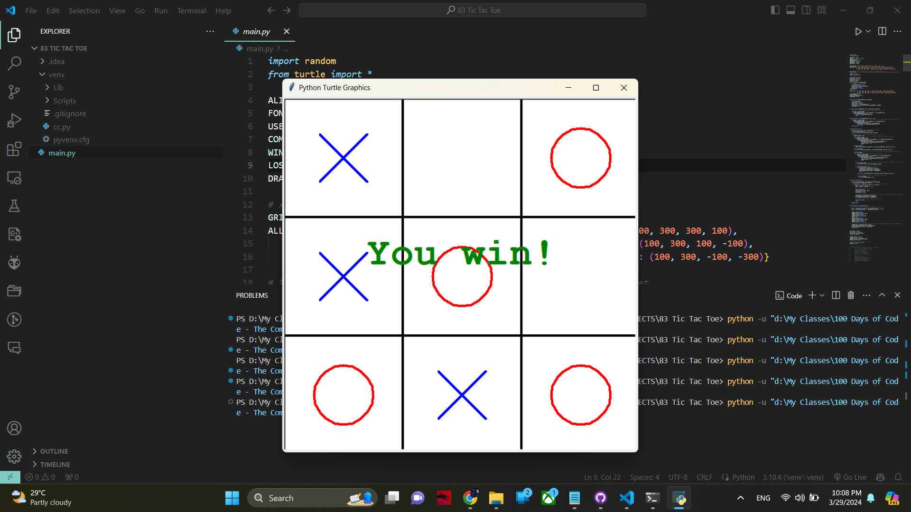
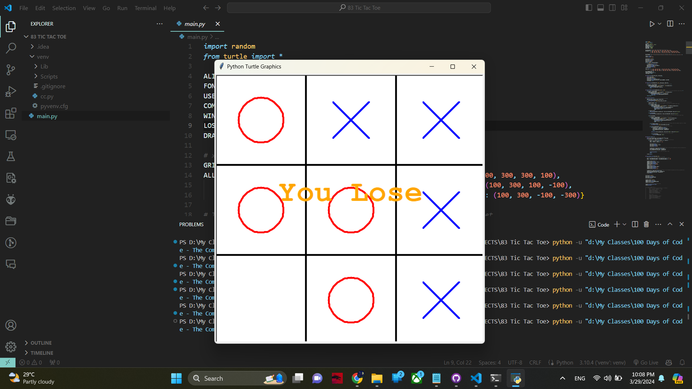
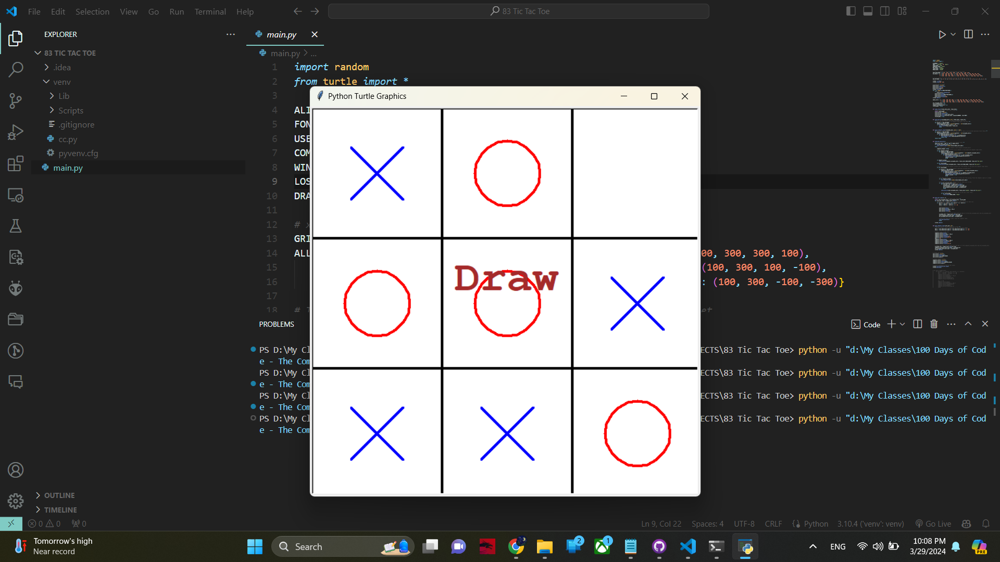

Certainly! Below is a complete README for the "Tic Tac Toe" project. To add the screenshots to the README file, you will typically use markdown to link the images from where they are hosted. If you host the images on a service like GitHub or an image hosting service, you can include them using the Markdown image syntax:

```markdown


```

Now, for the README content:

---

# Tic Tac Toe

## Introduction
Tic Tac Toe is a classic, two-player game where the objective is to get three of your marks in a row - horizontally, vertically, or diagonally. This implementation is a simple GUI-based game created using Python's Turtle graphics.

## Gameplay
The game is played on a grid that's 3 squares by 3 squares. Player one is 'X', and player two is 'O'. Players take turns putting their marks in empty squares. The first player to get 3 of her marks in a row (up, down, across, or diagonally) is the winner. When all 9 squares are full, the game is over.

## Technologies Used
- Python
- Turtle Graphics

## Features
- Simple and intuitive GUI.
- One player mode against the computer.
- Color-coded game status updates.

## Screenshots




## How to Play
1. Clone the repository to your local machine or download the zip file.
2. Make sure you have [Python](https://www.python.org/) installed on your system.
3. Run `main.py` to start the game.
4. Click on the grid to place your 'X'.
5. Watch as the computer places its 'O'.
6. The first to reach three marks in a row wins.

## Customization
You can customize the game by modifying the constants at the top of the `main.py` file.
