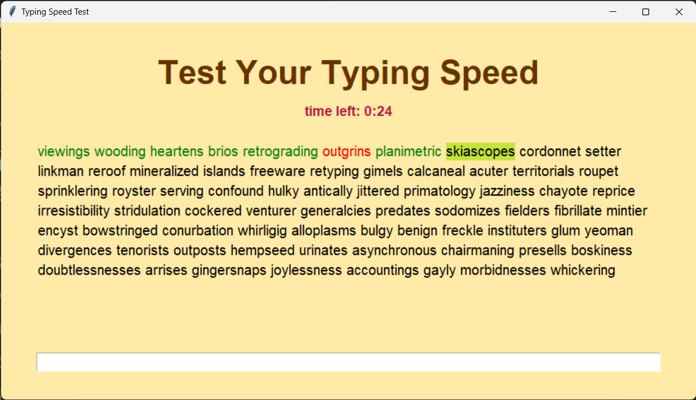

# Typing Speed Test

The Typing Speed Test is a simple and interactive GUI application built with Python's Tkinter library. It challenges users to type random English words within a limited time and calculates the typing speed in Words Per Minute (WPM).



## Features

- Random English word sequence for typing practice
- Real-time countdown timer
- Words Per Minute (WPM) calculation
- Highlights the currently typing word
- Shows results with a popup message box

## Installation

1. Ensure you have Python installed on your system.
2. Clone the repository or download the ZIP file and extract it.
3. Navigate to the project directory and install dependencies if any (`pip install -r requirements.txt`).

## Usage

To run the Typing Speed Test, execute the following command in the project directory:

```sh
python main.py
```

## How to Contribute

Contributions are what make the open-source community an amazing place to learn, inspire, and create. Any contributions you make are **greatly appreciated**.

1. Fork the Project
2. Create your Feature Branch (`git checkout -b feature/AmazingFeature`)
3. Commit your Changes (`git commit -m 'Add some AmazingFeature'`)
4. Push to the Branch (`git push origin feature/AmazingFeature`)
5. Open a Pull Request
