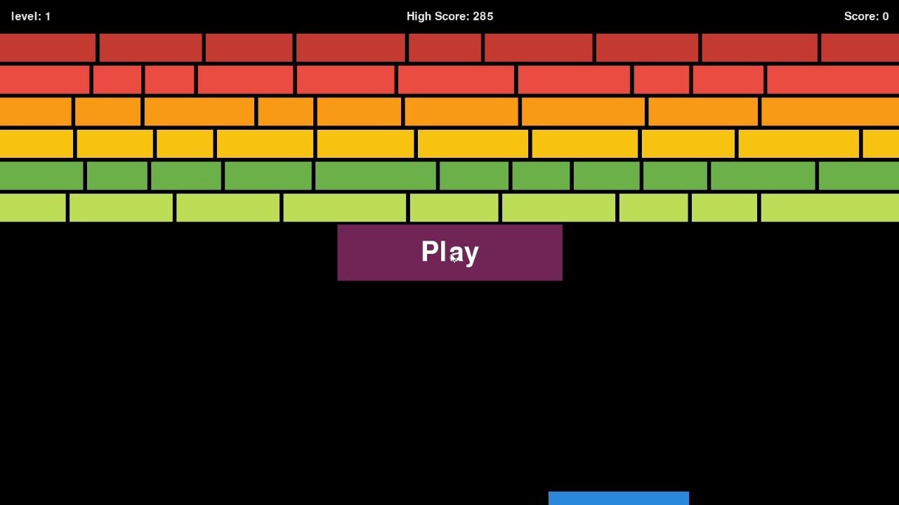

# Breakout Game



## Overview

**Breakout Game** is a classic arcade-style game developed using Python and Pygame. The objective is to control a paddle at the bottom of the screen, bounce a ball to break bricks arranged at the top, and progress through increasingly challenging levels.

## Features

- **Paddle Control**: Move the paddle left and right using the arrow keys.
- **Ball Physics**: Realistic bouncing mechanics when the ball collides with walls, the paddle, or bricks.
- **Brick Layout**: Multiple rows of bricks with varying colors and widths.
- **Score Tracking**: Keep track of your current score and compete against a persistent high score.
- **Levels**: Advance through levels that increase in difficulty, with faster ball speeds.
- **Play Button**: Start the game by clicking the "Play" button on the start screen.

## Installation

### Prerequisites

- **Python 3.x**: Ensure you have Python 3 installed on your system. You can download it from [python.org](https://www.python.org/downloads/).

- **Pygame**: This game uses the Pygame library for graphics and input handling.

### Installing Pygame

You can install Pygame using `pip`. Open your terminal or command prompt and run:

```bash
pip install pygame
```

If you're using Python 3's `pip`, you might need to use:

```bash
pip3 install pygame
```

### Downloading the Game

Clone the repository or download the source code files to your local machine. Ensure the following files are present:

- `main.py`
- `settings.py`
- `paddle.py`
- `ball.py`
- `bricks.py`
- `scoreboard.py`
- `button.py`
- `circle.png` (the ball image)
- `high_score.txt` (initially containing `0`)

### Setting Up `high_score.txt`

Before running the game for the first time, create a file named `high_score.txt` in the same directory as the Python scripts and add `0` to it. This file is used to store the high score.

You can create the file manually or use the following command in your terminal:

```bash
echo 0 > high_score.txt
```

Alternatively, create a text file named `high_score.txt` and type `0` as its content.

### Assets

- **circle.png**: This image file is used as the ball's graphic. Ensure it is placed in the same directory as the Python scripts.

## Running the Game

Navigate to the directory containing the game files and run the game using Python:

```bash
python main.py
```

Or, if using Python 3:

```bash
python3 main.py
```

Upon launching, the game will open in full-screen mode. Use the arrow keys to move the paddle and click the "Play" button to start the game.

## How to Play

1. **Start the Game**: Click the "Play" button on the start screen.
2. **Control the Paddle**: Use the **Left** and **Right** arrow keys to move the paddle horizontally.
3. **Bounce the Ball**: Keep the ball in play by bouncing it off the paddle to hit and break bricks.
4. **Break All Bricks**: Clear all bricks to advance to the next level.
5. **Avoid Missing**: Do not let the ball fall below the paddle. If you miss, the game ends.
6. **Score Points**: Each brick broken increases your score. Higher levels increase the points earned.
7. **High Score**: Your highest score is saved and displayed.

## Project Structure

- **`main.py`**: The main game loop and overall game management.
- **`settings.py`**: Configuration settings for the game, such as screen size, colors, and speeds.
- **`paddle.py`**: Defines the `Paddle` class for paddle movement and rendering.
- **`ball.py`**: Defines the `Ball` class for ball movement, collision detection, and rendering.
- **`bricks.py`**: Defines the `Brick` class for brick properties and rendering.
- **`scoreboard.py`**: Defines the `Scoreboard` class for tracking and displaying scores and levels.
- **`button.py`**: Defines the `Button` class for the Play button.

## Customization

You can customize various aspects of the game by modifying the settings in `settings.py`:

- **Screen Size**: Adjust `screen_width` and `screen_height`.
- **Colors**: Change the color tuples for the background, paddle, bricks, and text.
- **Paddle Size and Speed**: Modify `paddle_width`, `paddle_height`, and `paddle_speed`.
- **Brick Size and Colors**: Adjust `brick_height` and `BRICK_COLORS` in `main.py`.
- **Ball Speed**: Change the initial speed in `ball_speed` within `settings.py`.

## Troubleshooting

- **Missing `circle.png`**: Ensure the `circle.png` image file is in the same directory as the Python scripts.
- **`high_score.txt` Not Found**: Create the `high_score.txt` file with an initial value of `0`.
- **Pygame Errors**: Verify that Pygame is correctly installed and compatible with your Python version.
- **Full-Screen Issues**: If the game doesn't display correctly in full-screen mode, try running it in windowed mode by modifying the `pygame.display.set_mode` parameters in `main.py`.

## Acknowledgments

- **Pygame**: Thanks to the Pygame community for providing a powerful library for game development in Python.
- **Original Breakout Game**: Inspired by the classic arcade game Breakout.